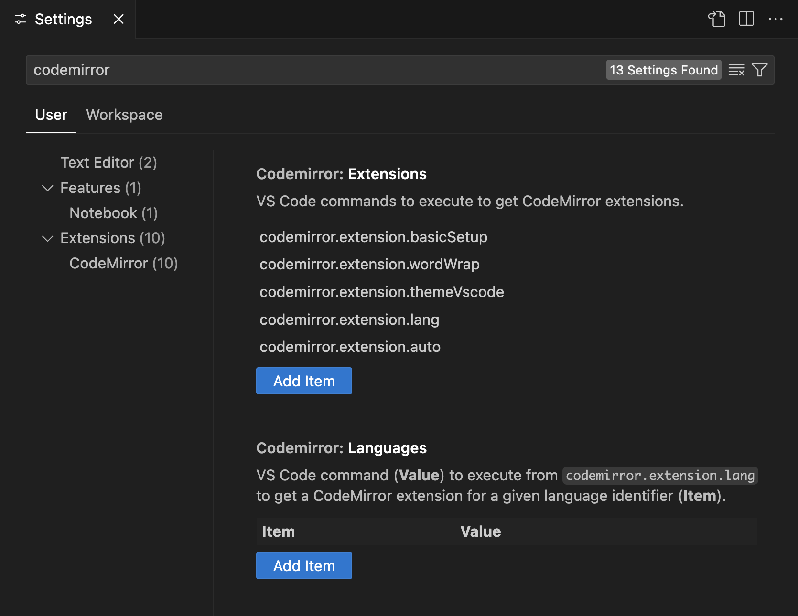

# CodeMirror in VS Code

[CodeMirror](https://codemirror.net/) as a [VS Code](https://code.visualstudio.com/) extension.

## Contents

<!-- toc -->

- [Motivation](#motivation)
- [Usage](#usage)
  - [Configuration](#configuration)
- [Extensibility](#extensibility)
  - [Example](#example)
- [Contributing](#contributing)
- [License](#license)

<!-- tocstop -->

## Motivation

In 2012, Bret Victor gave a talk titled [Inventing on Principle](https://youtu.be/PUv66718DII), in which he showed a demo of editing a JavaScript file that was being re-executed immediately on every change, with a little widget to edit numbers by dragging the mouse in an analog fashion instead of just typing:

[](https://youtu.be/PUv66718DII?t=252)

As of 2025, this sort of thing is not possible in Visual Studio Code, which [73.6% of developers "use regularly" according to the 2024 Stack Overflow Developer Survey](https://survey.stackoverflow.co/2024/technology#1-integrated-development-environment). However, it is possible in CodeMirror; for instance, here's a short demo video of [CodeMirror Interact by Replit](https://github.com/replit/codemirror-interact):

[](https://user-images.githubusercontent.com/9929523/147966613-270cdece-564f-4906-b6e8-b48975a0d9e2.mp4)

## Usage

This extension is not yet published to the VS Code Marketplace; check back later, or if you're curious then you can refer to [`CONTRIBUTING.md`](CONTRIBUTING.md) to build it from source.

Use the **Open in CodeMirror** command (bound to `ctrl+alt+c ctrl+alt+m` by default) to open the current file in a new CodeMirror editor.


### Configuration

**NOTE:** Probably you don't need to configure anything in this base extension, and can skip to the [Extensibility](#extensibility) section which talks about installing other VS Code extensions that depend on and extend this one. Consider the rest of this section "advanced usage".

To configure CodeMirror itself, add or remove items from the **`codemirror.extensions`** and **`codemirror.languages`** VS Code settings:



Here is a list of the CodeMirror extensions included in this VS Code extension:

- **`codemirror.extension.basicSetup`** is the `basicSetup` extension from the [`codemirror`](https://github.com/codemirror/basic-setup/tree/86f3699347713440e5b1a50b6a98d82963335d50) npm package, which "pulls together a number of extensions that you might want in a basic editor."

- **`codemirror.extension.minimalSetup`** is the `minimalSetup` extension from that same `codemirror` npm package, which is a "minimal set of extensions to create a functional editor."

- **`codemirror.extension.wordWrap`** is the CodeMirror [`EditorView.lineWrapping`](https://codemirror.net/docs/ref/#view.EditorView^lineWrapping) extension, gated by the VS Code [`editor.wordWrap`](https://code.visualstudio.com/docs/editing/codebasics#_how-do-i-turn-on-word-wrap) setting.

- **`codemirror.extension.themeVscode`** uses the VS Code [color theme kind](https://code.visualstudio.com/api/references/vscode-api#ColorThemeKind) to select between the dark and light themes provided by the [`@uiw/codemirror-theme-vscode`](https://www.npmjs.com/package/@uiw/codemirror-theme-vscode/v/4.23.10) npm package.

- **`codemirror.extension.vscodeDark`** applies the VS Code dark theme from the `@uiw/codemirror-theme-vscode` npm package.

- **`codemirror.extension.vscodeLight`** applies the VS Code light theme from the `@uiw/codemirror-theme-vscode` npm package.

- **`codemirror.extension.lang`** uses the [VS Code language identifier](https://code.visualstudio.com/docs/languages/identifiers) to dispatch according to the `codemirror.languages` setting, or loads and configures a [`@codemirror/lang-*`](https://www.npmjs.com/org/codemirror) extension as a fallback if one is [known](https://code.visualstudio.com/docs/languages/identifiers#_known-language-identifiers).

- **`codemirror.extension.auto`** expands to a list of all extensions that register themselves via the `codemirror.register` command.

## Extensibility

This extension is, itself, designed to be extensible. For instance:

- The CodeMirror Interact extension mentioned earlier is implemented as a [separate VS Code extension in this same repository](packages/codemirror-interact).

- The popular [iro.js](https://iro.js.org/) color picker is also available as a [separate extension in this repository](packages/codemirror-color-picker).

And it's straightforward to make your own VS Code extension to provide other CodeMirror extensions!

### Example

Let's say you want [CodeMirror Indentation Markers](https://www.npmjs.com/package/@replit/codemirror-indentation-markers/v/6.5.3) in VS Code. If you have [Node.js](https://nodejs.org/) installed, you just need to create four files. First, create a `.vscodeignore` file specifying what should be included in the package:

```
**
!dist
```

Next, put metadata and build scripts in `package.json`:

```json
{
  "publisher": "your-publisher-name",
  "name": "codemirror-indentation-markers",
  "version": "0.0.0",
  "engines": {
    "vscode": "^1.75.0"
  },
  "extensionDependencies": ["samestep.codemirror"],
  "main": "./dist/extension.js",
  "activationEvents": [
    "onCommand:codemirror.open",
    "onCommand:codemirror.openWordWrap",
    "onCommand:codemirrorIndentationMarkers.extension"
  ],
  "devDependencies": {
    "@replit/codemirror-indentation-markers": "^6",
    "@types/vscode": "^1",
    "@vscode/vsce": "^3",
    "codemirror-vscode": "^0.1",
    "esbuild": "^0.25"
  },
  "scripts": {
    "esm": "esbuild src/codemirror.ts --bundle --format=esm --external:@codemirror --external:@lezer --outdir=dist",
    "cjs": "esbuild src/extension.ts --bundle --format=cjs --platform=node --external:vscode --outdir=dist",
    "vsix": "vsce package --allow-missing-repository --skip-license",
    "build": "npm run esm && npm run cjs && npm run vsix"
  }
}
```

Then, put your VS Code extension entry point in `src/extension.ts`:

```typescript
import { CodeMirrorContext, ExtensionData } from "codemirror-vscode";
import * as vscode from "vscode";

export const activate = async (context: vscode.ExtensionContext) => {
  const command = "codemirrorIndentationMarkers.extension";
  context.subscriptions.push(
    await vscode.commands.executeCommand("codemirror.register", command),
    vscode.commands.registerCommand(
      command,
      async (cmCtx: CodeMirrorContext): Promise<ExtensionData<[]>> => ({
        uri: cmCtx
          .asWebviewUri(
            vscode.Uri.joinPath(context.extensionUri, "dist", "codemirror.js"),
          )
          .toString(),
        args: [],
      }),
    ),
  );
};
```

And put the CodeMirror extension itself in `src/codemirror.ts`:

```typescript
import { Extension } from "@codemirror/state";
import { indentationMarkers } from "@replit/codemirror-indentation-markers";

export default async (): Promise<Extension> => indentationMarkers();
```

Then run a couple commands to build it:

```sh
npm install
npm run build
```

If you're already in VS Code, right-click on the `codemirror-indentation-markers-0.0.0.vsix` file that just got created, and click **Install Extension VSIX**. And you're done! Now you'll get indentation markers when you execute **Open in CodeMirror**.

This is just a simple example, but you should be able to use the same pattern for pretty much any CodeMirror extension. If this doesn't work for your use case, feel free to open a [GitHub issue](https://github.com/samestep/codemirror-vscode/issues) or a [pull request](https://github.com/samestep/codemirror-vscode/pulls)!

## Contributing

See [`CONTRIBUTING.md`](CONTRIBUTING.md).

## License

This project is licensed under the [MIT License](LICENSE).
